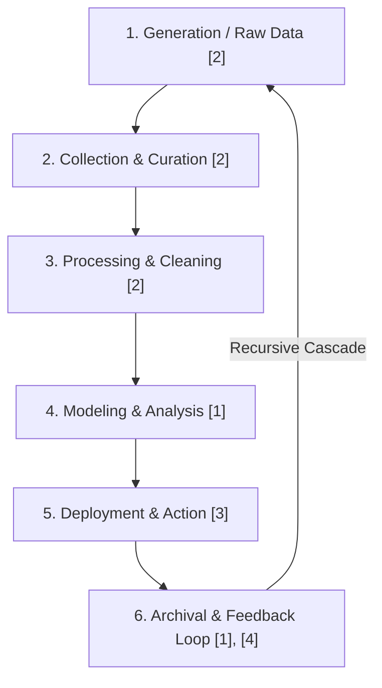

# 🗺️ Data Lifecycle Map (Portfolio Page 1)
**Student Name**: [Your Name]  
**Date**: September 14, 2026  
**Workshop**: MSU AI Club Fall Kickoff — *The Art of the Data Lifecycle: Storytelling in AI*  
**Today's Track**: Billy Joel — *Vienna*  

---

## 1. Executive Summary
This document forms Page 1 of my year-long MSU AI Club Portfolio. It establishes the 6-stage data lifecycle framework [1], [2], audits upstream data choices for credit and scholarship algorithms [2], and details actionable ethical commitments for modern AI practitioners [1]–[4].

---

## 2. The 6-Stage Lifecycle Audit & Personal Ethical Commitments

### Stage 1: Generation & Unmeasured Human Dimensions [2]
- **Audit Findings**: Raw datasets capture static metrics (credit score, formal income) while flattening non-traditional economic realities [2].
- **My Ethical Commitment**: *I commit to identifying missing features and unmeasured populations before model development begins.*

---

### Stage 2: Collection & Structural Barriers [2]
- **Audit Findings**: Group B applicants (underrepresented/non-traditional) face higher missingness in formal credit histories due to systemic exclusion [2].
- **My Ethical Commitment**: *I commit to advocating for multi-track alternative data collection (rental history, utility stability, gig verification).*

---

### Stage 3: Processing & The Cost of "Cleaning" [2]
- **Audit Findings**: Standard `dropna()` operations silently deleted 25% of Group B applicants. Median imputation preserved 100% of candidate profiles [2].
- **My Ethical Commitment**: *I commit to auditing data cleaning filters for demographic loss before dropping incomplete rows.*

---

### Stage 4: Modeling & Disparate Impact [1]
- **Audit Findings**: Baseline decision trees produced a Disparate Impact Ratio of 0.697 (below the legal 0.80 parity threshold) [1].
- **My Ethical Commitment**: *I commit to auditing model outputs against formal fairness metrics and inspecting opacity in black-box feature weightings.*

---

### Stage 5: Deployment & Recursive Feedback Loops [1]
- **Audit Findings**: Automated predictions fed back into future training data sharpen disparate impact from 0.697 to 0.375 over 4 generations [1].
- **My Ethical Commitment**: *I commit to enforcing human review audit sampling (10%+ manual oversight) to interrupt feedback cascades.*

---

### Stage 6: Archival, Deletion & Systemic Stewardship [1], [4]
- **Audit Findings**: Retaining stale or biased labels permanently perpetuates historical unfairness across model generations [1], [4].
- **My Ethical Commitment**: *I commit to establishing clear data retention, deletion, and governance protocols in every AI pipeline I build.*

---

## 3. References

[1] C. O'Neil, *Weapons of Math Destruction: How Big Data Increases Inequality and Threatens Democracy*. New York, NY, USA: Crown Publishing Group, 2016.

[2] C. D'Ignazio and L. F. Klein, *Data Feminism*. Cambridge, MA, USA: MIT Press, 2020.

[3] Pope Leo XIV, *Magnifica Humanitas: On Safeguarding the Human Person in the Time of Artificial Intelligence*, Encyclical Letter, Vatican City: Libreria Editrice Vaticana, 2025.

[4] E. Yudkowsky and N. Soares, *If Anyone Builds It, Everyone Dies: Why Superhuman AI Would Kill Us All*. New York, NY, USA: Little, Brown and Company, 2025.
